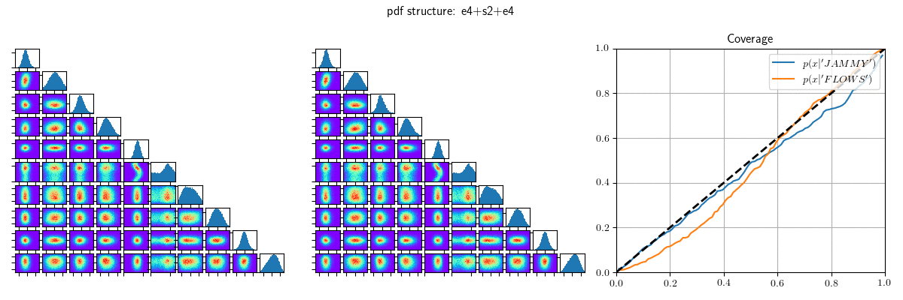

# jammy_flows


This package implements (conditional) PDFs with **J**oint **A**utoregressive **M**anifold (**MY**) normalizing-flows. It grew out of work for the paper [Unifying supervised learning and VAEs - automating statistical inference in high-energy physics [arXiv:2008.05825]](https://arxiv.org/abs/2008.05825) and includes the paper's described methodology for coverage calculation on joint manifolds. For Euclidean manifolds, it includes an updated implementation of the [offical implementation](https://github.com/chenlin9/Gaussianization_Flows) of [Gaussianization flows [arXiv:2003.01941]](https://arxiv.org/abs/2003.01941), where now the inverse is differentiable (adding Newton iterations to the bisection) and made more stable using better approximations of the inverse Gaussian CDF.


The package has a simple syntax that lets the user define a PDF and get going with a single line of code that **should just work**. To define a 10-d PDF, with 4 Euclidean dimensions, followed by a 2-sphere, followed again by 4 Euclidean dimensions, one could for example write
```
import jammy_flows

pdf=jammy_flows.pdf("e4+s2+e4", "gggg+n+gggg")
```
The first argument describes the manifold structure, the second argument the flow layers for a particular manifold. Here **"g"** and **"n"** stand for particular normalizing flow layers that are pre-implemented (see **Features** below). The Euclidean parts in this example use 4 **"g"** layers each.


Have a look at the [script](examples/jammy_flows.py) that generates the above animation or at the example [notebook](examples/examples.ipynb).

## Getting started

### Non-Conditional PDF

Lets say we have Euclidean 3-d samples "x" from a 3-d target distribution we want to approximate with a PDF p(x).
First we initalize a 3-d PDF:
```
import jammy_flows

pdf=jammy_flows.pdf("e3", "gggg")
```
We chose to do so with 4 Gaussianization flow layers. Next we just loop through the batches and minimize negative log-probability, assuming we have a torch optimizer:
```
# target_samples = array of 3-d samples from the target distribution
# batch_size: the given batch size
# num_batches_per_epoch: number of batches in the epoch
# optimizer: the given pytorch optimizer

batch_size=10

for ind in range(num_batches_per_epoch):
    this_label_batch=target_samples[ind:ind+batch_size]

    optimizer.zero_grad()

    log_pdf,_,_=pdf(this_label_batch)

    neg_log_loss=-log_pdf.mean()

    neg_log_loss.backward()

    optimizer.step()

### after training ###

## evaluation
# target_point = point "x" to evaluate the PDF at
# log_pdf, base_log_pdf, base_point = pdf(target_point)

## sampling
# target_sample, base_sample, target_log_pdf, base_log_pdf = pdf.sample(samplesize=1000)

```
### Conditional PDF

Let's now say we want to describe a 3-d conditional PDF p(x;y) that depends on some 2-dimensional input 'y'.

```
import jammy_flows

pdf=jammy_flows.pdf("e3", "gggg", conditional_input_dim=2)
```
Here we have to specify the conditional input dimension, and then in the training loop add the input.
The rest is very similar to the non-conditional PDF:

```
# target_samples = array of 3-d samples from the target distribution
# input_data = array of 2-d input data of same length as target_samples
# batch_size: the given batch size
# num_batches_per_epoch: number of batches in the epoch
# optimizer: the given pytorch optimizer

for ind in range(num_batches_per_epoch):
    this_label_batch=target_samples[ind:ind+batch_size]
    this_data_batch=input_data[ind:ind+batch_size]

    optimizer.zero_grad()

    log_pdf,_,_=pdf(this_label_batch, conditional_input=this_data_batch)

    neg_log_loss=-log_pdf.mean()

    neg_log_loss.backward()

    optimizer.step()

### after training ###

## evaluation
# target_point = point "x" to evaluate the PDF at
# log_pdf, base_log_pdf, base_point = pdf(target_point, conditional_input=some_input)

## sampling, shape of 'some_input' defines number of samples in conditional pdf
# target_sample, base_sample, target_log_pdf, base_log_pdf = pdf.sample(conditional_input=some_input) 

```
### Documentation

Hopefully following soon. In the meantime check out the [example script](examples/jammy_flows.py) and [example notebook](examples/examples.ipynb).

## Features

### General

- [x] Autoregressive conditional structure is taken care of behind the scenes
- [x] Coverage is straightforward. Everything, including spherical dimensions, is based on a Gaussian base distribution ([arXiv:2008.0582](https://arxiv.org/abs/2008.05825)).
- [x] Bisection & Newton iterations for differentiable inverse (used for Gaussianization flow and Moebius flow)
- [x] amortizable MLPs that use low-rank approximations
- [x] unit tests that make sure backwards / and forward flow passes of implemented flow-layers agree 
- [x] include log-lambda as an additional flow parameter to define parametrized Poisson-Processes
- [x] easily extendible: define new Euclidean / spherical flow layers by subclassing Euclidean or spherical base classes

- [ ] Interval flows
- [ ] Categorical variables for joint regression/classification

### Euclidean flows:

- [x] Gaussianization flow (described in [arXiv:2003.01941](https://arxiv.org/abs/2003.01941)) (**"g"**)
- [x] Hybrid of Nonlinear Scalings and HouseHolder Rotations ("Polynomial Stretch flow") (**"p"**)

### Spherical flows:

### S1:
- [x] Moebius Transformations  (described in [arXiv:2002.02428](https://arxiv.org/abs/2002.02428)) (**"m"**)

### S2:
- [x] Autorregressive flow for N-Spheres (inspired by [arXiv:2002.02428](https://arxiv.org/abs/2002.02428)) (**"n"**)
- [ ] ODE-manifold flow ala FFJORD [arXiv:2006.10254](https://arxiv.org/abs/2006.10254)/[arXiv:2006.10605](https://arxiv.org/abs/2006.10605)
 
### Interval Flows:

- [ ] Spline Flows (e.g. use Pyro implementation)

## Requirements

- pytorch (>=1.6)
- numpy (>=1.15)

## Installation
```
pip install git+https://github.com/thoglu/jammy_flows.git
```
## Contributions

If you want to implement your own layer or have bug / feature suggestions, just file an issue, and we can discuss the pull request process.
Any other questions / comments: thorsten.glu@gmail.com